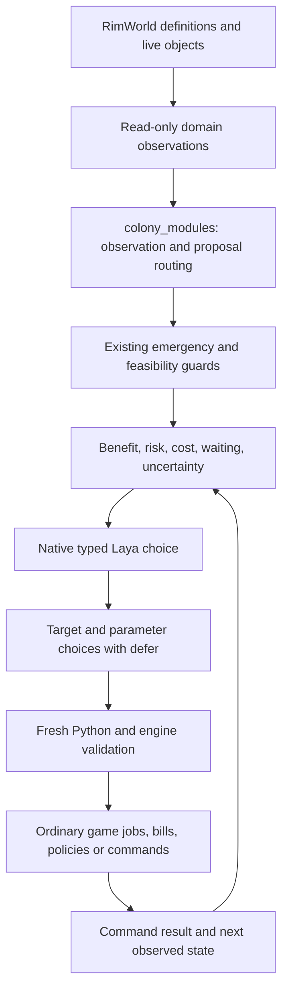

# Modular decisions and measured outcomes — 0.0.7

This is an incremental extraction, not a claim that the legacy director has
already been fully decomposed. New domain executors are outside the director.
Its existing emergency sequencing, construction orchestration and event loop
remain in place and continue to require scenario validation.

## Boundaries

| Module | Responsibility | Main evidence |
|---|---|---|
| `colony_actions` | Legacy vocabulary and overlay labels | Existing action definitions; no execution |
| `colony_modules` | Whitelisted domain ownership, collection status, proposal and execution routing | No model-generated Python or endpoints |
| `colony_production` | Utilities, loaded table recipes and material logistics | Native components, whole-unit stock allocation, ordinary bills and workers |
| `colony_sustenance` | Food, preservation, animal husbandry, diets and fishing | Native stock, recipes, pens, medicine/food policies and jobs |
| `colony_resilience` | Patient care, disease, sanitation, temperature, roof and diagnosis | Visible symptoms, native workgivers, evidence-gated operations |
| `colony_society` | Medicine, prisoner policies, childcare, growth, drugs, deathrest and surgery | Instantiated needs, earned options, beliefs and ordinary policies/jobs |
| `colony_progression` | Prerequisite frontier and finite Core/DLC ending chains | Native quests, blockers, intermediate choices and persisted credits evidence |
| `colony_specialists` | Mechs, containment, rituals, genes, permits, meditation and dryads | Active DLC, native dialogs and current capabilities |
| `colony_affordances`, `colony_sessions` | Loaded abilities/interactions and pending native choices | Current callbacks/targets, costs, effect identity and modal/session validation |
| `colony_capabilities` | Crops, blight, augmentation, equipment and trained animals | Subject history, native atomic command guards and repair of partial auxiliary steps |
| `colony_expeditions` | Shared trade, raid and rescue planning outside the domain registry | Native two-leg ETA, nutrition, mass, home reserves, exact confirmation and persisted formation identity |
| `colony_combat` | Threat geometry, available tactics and target selection | Live positions, capabilities and contact distance |
| `colony_mental_safety` | Protection of a named allied murderous-rage victim alongside raid defense | Native session, actual Goto/Arrest/Rescue, resistance and path risks; scoped observation and progress leases |
| `colony_downed_combat` | Explicit finishing of a selected downed hostile | Native violence/verb/target guards before atomic drafting; observed kill flag; pending and stalled job reconciliation |
| `colony_wildlife` | Selected hunters, contextual harm assessment and group job lifecycle | Actual actor equipment and retaliation chance; scoped pending orders, observed progress and cleanup |
| `colony_inspirations` | Current professional opportunities and exact worker/target choice | Loaded inspiration definitions, expiration and consumption identity; normal taming, recruitment and worker-restricted production |
| `colony_architect` | Building purpose, materials and generated layouts | Actual catalog, stock, research and placement checks |
| `colony_shipbuilding` | Persistent connected ship layout and separately funded building stages | Native blueprint preview, completed beams before caskets, observed placements, unallocated stock |
| `colony_strategy`, `colony_growth`, `colony_professions`, `colony_events` | Existing course, population, workforce and event support | These remain partial; catalogue entries are not completed chains |
| `colony_reasoning`, `laya_decisions` | Consequence descriptions and bounded native comparisons | Exact compared state is logged |
| `colony_outcomes` | Last order and subsequent measured changes | Acceptance, observation and completion are distinct |

## Extension contract

Each registered domain defines `DESCRIPTIONS`, `LABELS`, `ACTIONS`, `DOMAINS` and:

1. `collect(client, snapshot) -> dict`: read current context; never issue orders.
2. `prepare(snapshot, map_state) -> list[str]`: propose registered actions and
   store current typed options inside its own development namespace.
3. `assess(action, snapshot) -> dict`: benefit, risk, cost, inaction, uncertainty.
4. `choose(agent, state, action, snapshot) -> (parameters, raw)`: native Laya
   choice over actual alternatives, including retaining the current policy.
5. `execute(client, snapshot, map_state, action, parameters) -> dict`: allowlist
   parameters, refresh eligibility and use an ordinary game action. Return an
   explicit boolean `applied`; do not replace the selected action silently.

Startup aliases must project the owner's prepared plan for all three stages:
candidate, parameter selection and execution. Founder equipment uses the
capability executor; it must not reconstruct a different recipient list.
Subject-level histories must leave other subjects available. Native active-job
observations protect pending haul/feed/rescue work across timer expiry.
Interrupt records expose `blocks_development`: modal work owns scheduling,
while quiet nonmodal waiting and failed event attempts permit normal development.
See [sequence verification requirements](audits/startup-loop-replay-2026-10-03.md).

Module identifiers are static code registrations. Duplicate or wrongly prefixed
actions are rejected. Collection errors clear stale module context, suppress
that domain's candidates and produce a warning; unrelated modules remain usable.
Proposal preparation errors also clear only that domain's partial context,
record the failing phase, and allow unrelated modules to continue. A fresh
collection is required before retrying it. Registration errors remain explicit.
All new runtime modules are included in `install_payload.py`.

An empty dynamic parameter set raises the typed `NoFeasibleChoice`. Development
records `selection_unavailable` with the selected action/question/work type,
issues no incomplete order and continues scheduling. Invalid model answers and
unexpected inference errors remain errors. Generic work proposals, worker
choices and execution use the same care protection criteria.

## What “consider negative outcomes” means here

The installed English Laya is a typed decision model, not a text-generating
planner. It chooses among supplied alternatives; we cannot obtain a textual
internal deliberation by asking for it. The checkpoint in this installation has
`max_len=512`, `head_max_len=192`. This matches the English entry in the
[author's model card](https://huggingface.co/convaiinnovations/laya/blob/main/README.md).
Other checkpoints have different limits; this change does not switch models or
load larger weights.

Before action selection, each compared alternative gets five explicit fields:

- benefit: what the action can provide;
- risk: how it can harm the colony or fail;
- cost: material, labor, service interruption or recovery;
- inaction: what continues if the order is not issued;
- uncertainty: what current observations do not establish.

These are game-grounded descriptions, not calibrated probabilities or simulated
future outcomes. Legacy actions receive conservative family-level descriptions
with specific crop, hunting, power and surgery overrides. Detailed new actions
provide their own native facts. Authoring more text alone does not train Laya.

The adapter reserves space **by field and by compared alternative**, so a long
benefit cannot evict all downside. Token counts include the full JSON envelope.
Each comparison records the actual visible state and budget. Context never
pretends an omitted fact was seen. Detailed legacy descriptions still use
bounded prefixes; this limitation is distinct from the new consequence cards.

## Cost and performance

- Broad domain/family selection remains hierarchical; detailed evidence is
  supplied when choosing an operation and its parameters.
- Consequence comparisons use pairs. For N alternatives the tournament requires
  at most N−1 predictions. This costs more calls than one coarse six-way choice,
  but preserves meaningful downside within the installed window. No extra
  “critic” model or second GPU model is loaded.
- A tournament is order-sensitive and can miss a preference cycle; its winner
  and reported weights are not a proof of an optimal plan or survival odds.
- Prompt clipping uses binary search instead of repeatedly removing a few
  characters and tokenizing the whole string. Token-count caching is local to a
  comparison and cannot accumulate colony histories.
- Shared research observations are reused for proposal collection. Execution
  refreshes them. Live stock, injuries, targets and eligibility are not cached
  across execution.
- Production's exclusion set is derived once from loaded definitions, rather
  than scanning the entire ThingDef database for every stack and recipe item.
- Every module records observation time (`read_ms`). These measurements support
  later profiling; no claim is made that the previously reported CPU spikes
  have been reproduced or fixed.
- The director's retry gate covers pending world/modal reads before map
  collection. Repeated failures obey exponential backoff even with no map;
  the local heartbeat continues without repeating those API calls.

## Observation, memory and intent

### Campaign, map and pending native session

`EndingEvidence.CampaignId` is persisted in the game save. Python binds doctrine
and income intent to that identity; changing maps or accepting an Archonexus
colony transfer does not create a new strategic goal. A different campaign clears
old map orders; loading an earlier tick cannot restore a future doctrine.
Map coordinates, construction footprints and issued-order markers stay local.

The colonist endpoint covers maps and caravans. Pawn `map_id` and `spawned` now
separate available local workers from that global roster. Map selection also
sees native ship passengers, so boarding the last pawn cannot hide the ship
behind the abandoned home map. Empty maps are distinct from verified game over.
During mapless travel, world continuation, caravan trade and native dialog
handlers run before any request for a map snapshot.

Temporary maps use the same domain executors for care, interactions and endings,
with a restricted list of unrelated home construction. Shelter startup filters
do not suppress native boarding or final interactions. Rescue continuation is
bound to the actual world site ID; an old rescue intent cannot recall an
expedition from an unrelated ending site.

### Prerequisites shared across domains

`colony_modules.goal_requirements` exposes compact chosen-route journey needs
and missing ship materials. These facts reach domain selection and every
production sub-selection. Actual complete catalogs remain in module snapshots.
Doctrine comparisons retain the selected ending throughout income and work
choices. Production no longer loses this goal when choosing a recipe or table.

Oversized legacy choices now use explicit bounded packing before the model
encoder. This prevents silent encoder truncation; the stored visible-state log
still identifies which detail was omitted. English model criteria and Russian
display labels have separate responsibilities.

### Native work and observed acceptance

`/builder/blueprint/preview` reads exact rotated footprints, current research,
stuff, native placement rules, overlaps and interaction cells without placing
anything. Proposed beams/floors do not count as completed prerequisites.
`colony_shipbuilding` reserves one connected site, funds available parts, waits
for actual beam completion and retries missing parts. Architecture and ship
placement read back exact definition/coordinates; an empty successful envelope
does not establish that construction was placed or completed.

Ending journeys use normal caravan formation and saved native visit arrival
actions. Native path/rest/movement estimates are calculated once per team and
destination within an observation, then shared by supply alternatives. Estimates
can change; travel, arrival, boarding and launch countdown are separate states.
Trade discovery can offer an exact live `item:<def>` such as an AI persona core;
execution revalidates price, funds, sold inventory and the chosen reserve.
Native trade preview temporarily initializes the game trade session and restores
its four static session fields in `finally`. It is not described as a pure read:
native setup may emit messages and initialize trader silver allocations.

Royal hospitality context includes actual and prospective quest guests, effective
native room requirements and qualifying ownership choices. The director merges
this into architecture and research observations. Required furniture/floor
alternatives expose supporting research; completed room impressiveness and
assignment are checked later. Room identity uses `role_def_name` across game
languages, while the original display label is preserved. Emergency care unwraps
the native `{rooms: [...]}` envelope rather than silently discarding it.

The existing doctrine remains the persistent intended course. Progression now
compares that intention with a real prerequisite frontier and engine blockers.
Ship launch countdown is distinct from verified victory. Native Core, Royalty,
Ideology, Anomaly and Odyssey ending paths have explicit continuation handlers.
Odyssey is DLC-gated and compiled against shared classes; its Data is absent here.

`colony_outcomes` stores one bounded before-observation per map and reconciles it
at the next decision. It records changed meals, nutrition, on-map population,
downed people, construction count, completed research and threats. A changed
count is **not causal attribution**, a missing on-map pawn is **not a diagnosed
death**, and no measured change is **not proof of failure**. Exact domain
completion still requires domain-specific observation. Same-tick decisions
report that game progress is pending; a backwards tick discards the previous
timeline's order.

## Evidence and remaining coverage

See the [comprehensive inventory and closure audit](COMPREHENSIVE_AUDIT_0.0.7.md),
[production](modules/production.md), [society](modules/society.md),
[progression](modules/progression.md), [combat](modules/combat.md) and
[specialists](modules/specialists.md), plus [affordances and targeting](modules/affordances.md).
Each distinguishes executable additions,
read-only context and missing mechanics. Installed RimWorld 1.6 definitions and
engine methods are the primary compatibility evidence; web sources supply
reference context. Odyssey is not treated as active on this installation.

Offline fixtures, compilation and tokenizer checks establish code and protocol
properties. They do not establish successful colony survival, correct live job
completion or victory. No game, colony, director or observer was started for
this change. No model weights were trained.

## Failure clocks across game speeds

`colony_retry` provides JSON-safe tick and wall-clock expiry. Resilience and
society failed options wait at least 15 seconds; production, sustenance,
specialists, affordances and capabilities wait at least 30 seconds. Their
existing tick horizons must expire as well. Only the same failed option is
suppressed; successful/deferred policies retain game-time semantics. Malformed
records and either clock moving backwards invalidate that record. Pending
specialist dialogs retain their two-second retry, and pending native targeters
retain their bounded 1/2/4/5-second schedule. Combat/event retries are separate.
Construction repairs and legacy hospital failures wait for both 2500 ticks and
30 seconds; rescue-site failures retain a 15-second/60-tick floor. These guards
apply to the selected failed project or mission operation.
These intervals suppress transport/rejection churn; they do not certify that
Laya has learned a successful strategy.
